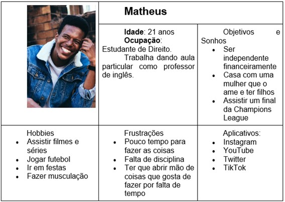

# Especificações Do Projeto
## Personas
>

>

>

>

>
> 

## Histórias de Usuários

Com base na análise das personas forma identificadas as seguintes histórias de usuários:

|`PERSONA`|`DESEJO`|`RAZÃO`|
|--------------------|------------------------------------|----------------------------------------|
|BRUNA|Parar de perder tempo usando Whatsapp e Pinterest.|Ter mais tempo para se dedicar ao estudo e fazer exercícios.|
|BRUNA|Estabelecer metas e compartimentar tarefas mais difíceis para concluí-las com mais facilidade.|Manter a saúde mental em equilíbrio e evitar ansiedade e sentimentos de culpa causados pela improdutividade.|
|BRUNA|Desenvolver as habilidades de concentração e foco.|Conseguir fazer atividades sem adiá-las, uma vez que elas podem ser feitas em poucas horas (no máximo).|
|JORGE|Aprimorar a organização e o planejamento das tarefas do dia.|Evitar o estresse causado pelo acúmulo de atividades atrasadas.|
|JORGE|Reduzir o tempo gasto em atividades paralelas e aumentar o rendimento e a produtividade.|Criar bons hábitos para trilhar um caminho de sucesso para o futuro.|
|JORGE|Ser recompensado ao terminar tarefas complexas e incentivado a não desistir ao não conseguir completá-las.|Se sentir realizado e bem consigo mesmo e evitar o desgaste emocional.|
|ANA VITÓRIA|Redirecionar o tempo gasto no celular e em mídias digitais para o estudo.|Resolver mais exercícios para ser aprovada na faculdade quando terminar o Ensino Médio.|
|ANA VITÓRIA|Administrar melhor o tempo para estudar somente durante as horas destinadas ao estudo.|Não desperdiçar o tempo livre ou com a família fazendo tarefas que já deveriam ter sido feitas.|
|ANA VITÓRIA|Ser mais responsável e cumprir obrigações sem ser pressionada.|Executar trabalhos e tarefas com calma e antecedência, não “em cima da hora”.|
|MATHEUS|Criar uma rotina que possa ser visualizada em forma de documento ou algo similar.|Evitar esquecer de fazer tarefas importantes e perder prazos de entrega.|
|MATHEUS|Maximizar o aproveitamento do tempo disponível para fazer as tarefas.|Conciliar a realização das atividades do trabalho e do estudo da faculdade. |
|MATHEUS|Limitar o tempo para a realização de tarefas da faculdade e do trabalho.|Não comprometer os momentos de lazer como festas e jogos de futebol com os amigos, por exemplo.|
>
>

## Requisitos

As tabelas que se seguem apresentam os requisitos funcionais e não funcionais que detalham o escopo do projeto.

### Requisitos Funcionais

|ID    | Descrição do Requisito  | Prioridade |
|------|-----------------------------------------|----|
|RF-01| O site deve possibilitar a entrada das tarefas, das obrigações e do horário do usuário disponível para realizá-las.| ALTA | 
|RF-02| Apartir do cadastro, o site deve montar uma agenda personalizada, organizando o tempo segundo as necessidades exclusivas de cada usuário.| ALTA |
|RF-03| O site deve disponibilizar uma apresentação da agenda.| MÉDIA |
|RF-04| O site deve disponibilizar o download da rotina personalizada do usuario.| MÉDIA |
|RF-05| O site deve possuir um menu que possibilite o usuário flutuar entre as abas do mesmo. MÉDIA |
|RF-06| O site deve possuir contatos de psicólogos e profissionais da área, além do Centro de Valorização da Vida (CVV).| BAIXA |

### Requisitos não Funcionais

|ID     | Descrição do Requisito  |Prioridade |
|-------|-------------------------|----|
|RNF-01| Publicação do site em um ambiente acessível publicamente na Internet (Repl.it, GitHub Pages, Heroku).| ALTA | 
|RNF-02| O site deve ser responsivo permitindo a visualização em um celular de forma adequada.|  ALTA | 
|RNF-03| Compatibilidade com os principais navegadores do mercado (Google Chrome, Firefox, Microsoft Edge).|  ALTA | 
|RNF-04| Função de exportar a agenda criada por meio de arquivo PDF ou PNG.|  ALTA | 
|RNF-05| Possibilidade de vincular a agenda criada ao e-mail do usuário.|  MÉDIA | 
>
> 

## Restrições

O projeto está restrito pelos itens apresentados na tabela a seguir.

|ID| Restrição                                             |
|--|-------------------------------------------------------|
|RE-01| O projeto deverá ser entregue no final do semestre letivo, não podendo extrapolar a vigésima semana da matéria. |
|RE-02| O projeto poderá unicamente ser desenvolvido pelos integrantes do grupo.|
|RE-03| O projeto deve ser limitado ao desenvolvimento front-end.|
>
