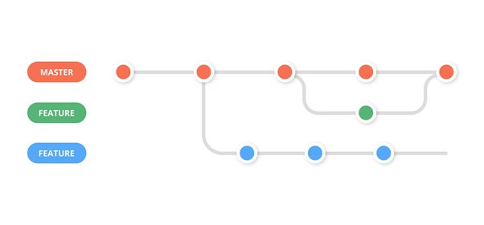

# Gestão de Configuração

## Controle de Código Fonte

É utilizado para a gestão do código fonte do software desenvolvido pelo grupo, um processo baseado no Git Feature Branch Workflow, de tal forma que as manutenções no código são realizadas em branches separados, seguindo a explicação do site [zepel.io](https://zepel.io/blog/5-git-workflows-to-improve-development/) sobre esse processo.

> Demonstração do Modelo
> 
> 
