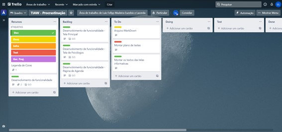

# Gerenciamento de Projeto

## Divisão de Papéis

A equipe está dividida da seguinte maneira:
*	Product Owner: Rommel Vieira Carneiro
*	Equipe de desenvolvimento:
1. Igor Franco Côrrea (Desenvolvedor Front End)
2. João Victor Horta Fontes (Desenvolvedor Front End)
3. João Pedro Lindenberg Pimenta (Desenvolvedor Front End)
4. João Vitor Lima de Melo (Desenvolvedor Front End)
5. Luis Fellyp Madeira Euzebio E Lacerda (Desenvolvedor Front End)

## Processo

Para organização e distribuição das tarefas do projeto, a equipe utilizou o Trello estruturado com as seguintes listas:

* Recursos: esta lista mantém um template de tarefas recorrentes com as configurações padronizadas que todos devem seguir. O objetivo é permitir a cópia destes templates para agilizar a criação de novos cartões.
*	Backlog: recebe as tarefas a serem trabalhadas e representa o Product Backlog. Todas as atividades identificadas no decorrer do projeto também devem ser incorporadas a esta lista.
*	To Do: Esta lista representa o Sprint Backlog. Este é o Sprint atual que estamos trabalhando.
*	Doing: Quando uma tarefa tiver sido iniciada, ela é movida para cá.
*	Test: Checagem de Qualidade. Quando as tarefas são concluídas, eles são movidas para o “CQ”. No final da semana, eu revejo essa lista para garantir que tudo saiu perfeito.
*	Done: nesta lista são colocadas as tarefas que passaram pelos testes e controle de qualidade e estão prontos para ser entregues ao usuário. Não há mais edições ou revisões necessárias, ele está agendado e pronto para a ação.
*	Locked: Quando alguma coisa impede a conclusão da tarefa, ela é movida para esta lista juntamente com um comentário sobre o que está travando a tarefa.

> [**Quadro Kanban no Trello**](https://trello.com/b/ELKuTYSF/tiaw-procrastina%C3%A7%C3%A3o)

## Ferramentas
|`AMBIENTE`|`PLATAFORMA`|`LINK DE ACESSO`|
|--------------------|------------------------------------|----------------------------------------|
|Repositório de Código Fonte|GitHub|https://github.com/ICEI-PUC-Minas-PMGCC-TI/tiaw-pmg-cc-m-20212-procrastinacao-2|
|Plataforma de Trabalho Colaborativo|Miro|https://miro.com/app/board/o9J_ly2NH0g=/|
|Projeto de Interface e Wireframes|Figma|https://www.figma.com/proto/0KGLjirM4Nm6uZ71fCyf8S/Untitled?node-id=1%3A2&scaling=min-zoom&page-id=0%3A1&starting-point-node-id=1%3A2|
|Gerenciamento do Projeto|Trello|https://trello.com/b/ELKuTYSF/tiaw-procrastina%C3%A7%C3%A3o|

